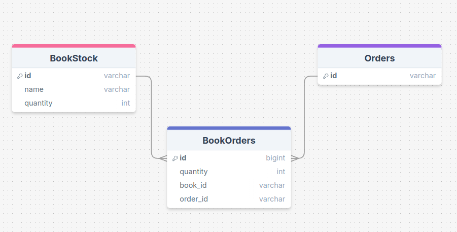

# Commerce Services - Technical Interview Solution

> [!NOTE]
> The original README with the assigment description can be found in
> the [ASSIGNMENT.md](ASSIGNMENT.md) file.

## Table of Contents

* [Commerce Services - Technical Interview Solution](#commerce-services---technical-interview-solution)
    * [Table of Contents](#table-of-contents)
    * [Overview](#overview)
    * [How to Run](#how-to-run)
        * [Run Packaged Application](#run-packaged-application)
        * [Run from Source](#run-from-source)
    * [Technologies Used](#technologies-used)
    * [Design Decisions and Assumptions](#design-decisions-and-assumptions)
        * [Documentation](#documentation)
            * [API Documentation](#api-documentation)
        * [Refactoring the Initial Source Code](#refactoring-the-initial-source-code)
        * [Database](#database)
        * [Models](#models)
        * [API Endpoints](#api-endpoints)
        * [Asynchronous Stock Updates](#asynchronous-stock-updates)
            * [Implementation](#implementation)
            * [Potential Race Condition](#potential-race-condition)
        * [Exception Handling and Validation](#exception-handling-and-validation)
            * [BookStockExceptionHandler](#bookstockexceptionhandler)
            * [OrderExceptionHandler](#orderexceptionhandler)
            * [GlobalExceptionHandler](#globalexceptionhandler)
    * [Testing](#testing)

## Overview

This branch contains my solution to the Technical Interview Assignment which can be found
in the [ASSIGNMENT.md](ASSIGNMENT.md) file. It adheres to the stated requirements and
contains the following:

- A fully working application with the following functionalities:
    - Creating new orders via a POST endpoint available at `http://localhost:8080/orders`
    - Retrieving all orders via a GET endpoint available at `http://localhost:8080/orders`
    - Retrieving a single order via a GET endpoint available at
      `http://localhost:8080/orders/{orderId}`


- A test suite that covers the functionalities of the application which includes both unit
  and integration tests.


- A packaged JAR file which is available in
  the [releases page](https://github.com/iivvaannxx/magento-order-management/releases/tag/1.0.0)
  and a zip file containing the documentation generated by the `javadoc` Maven plugin.

## How to Run

### Run Packaged Application

If you want to run the packaged application, you can download the latest
release [from here](https://github.com/iivvaannxx/magento-order-management/releases/tag/1.0.0)
and, provided you have **Java 17** installed, run the following command:

```bash
$ java -jar bookstore.jar
```

If you don't want to leave your terminal, you can run the packaged application executing
only the 2 commands below, you'll need to have either `Java 17` installed or `docker`.

```bash
# Download the packaged application from the releases page.
$ curl -L https://github.com/iivvaannxx/magento-order-management/releases/download/1.0.0/bookstore.jar -o bookstore.jar

# Run the packaged application (use only one of the two commands below).
$ java -jar bookstore.jar
$ docker run --rm -p 8080:8080 -v "$(pwd)/bookstore.jar:/app/bookstore.jar" openjdk:17-jdk-slim java -jar /app/bookstore.jar
```

### Run from Source

If you want to run the application from the source code, you only need the two commands
below, and it is not necessary to have anything installed (except for `git`):

```bash
$ git clone https://github.com/iivvaannxx/magento-order-management.git && cd magento-order-management
$ ./mvnw spring-boot:run # or ".\mvnw.cmd spring-boot:run" on Windows.
```

## Technologies Used

> [!IMPORTANT]
> **About Nix**: I am used to create and manage my development environments using a tool
> called [devenv](https://devenv.sh/), that is built
> upon [Nix](https://nix.dev/tutorials/nix-language.html)
> and [Nix Flakes](https://www.tweag.io/blog/2020-05-25-flakes/). Those 3
> files in the repository `flake.nix`, `devenv.nix` and `.envrc` are what I used to create
> my development environment for this project.
>
> **You can ignore those files as they are just tools for my personal use.** I would have
> just .gitignored them, but they sync to the Git repository and need to be in the source
> tree to work properly.

- Java 17
- Google Java Format (all the code is formatted using this tool)
- Spring Boot
- Maven
- H2 Database
- IntelliJ IDEA
- Nix

## Design Decisions and Assumptions

Below I outline the principal design decisions I made during the development. Feel free
to reach out to me if you have any questions or something is not clear.

### Documentation

I usually document all the code I write, and this project is no exception. I used Javadoc
on all the source code, and I also generated a zip file containing the documentation. It
is available in
the [releases page](https://github.com/iivvaannxx/magento-order-management/releases/tag/1.0.0).

You can also generate the documentation locally by running the following command:

```bash
$ ./mvnw javadoc:javadoc
```

This will generate the documentation in the `target/site/apidocs` directory. Just navigate
to the directory and open the `index.html` file to view the documentation.

#### API Documentation

I did not use any specific documentation tool for the API endpoints, I could have used a
tool like Swagger, but the API is very simple and small, so I decided to just write the
documentation [below](#api-endpoints).

### Refactoring the Initial Source Code

I did a small refactoring of the initial source code for the sake of consistency with what
I was going to implement. This only included the following changes:

- Move the `BookStock` model and all its related code to the `bookstock` package.

- Implemented a `BookStockService` class that handles the business logic of the
  `BookStock` model. Previously there was no such class and the `BookStockResource`
  queried directly the `BookStockRepository`.

### Database

In order to keep things simple and to avoid having to deal with setting up a database like
PostgreSQL or MySQL (even if Docker simplifies the process), I decided to use H2 as the
database for this project as it can work out of the box. In a real-world scenario it would
be better to use a database that is more robust and has a better support for concurrency.

The application uses a file-based H2 database, which is created upon start. Every time
the application starts, it will drop the database and create a new one.

Here's a diagram of the database schema (generated using [drawSQL](https://drawsql.app/)):



### Models

I've kept the models as simple as possible. They only hold the data needed to make the
application work. There's no need to say that in a real-world scenario, the models would
be more complex. These are:

- `BookStock`: This model represents a book entity. It was given in the initial source
  code. It contains the book identifier, name and the available stock of the book. The
  requested functionalities required to add a new `Set` of `BookOrder` to this model to
  accurately represent the many-to-many relationship it has with the `Order` model.


- `Order`: This model represents an order entity. It is defined by an auto-generated
  Unique Order Identifier in the form of an `UUID` string, and it contains a `Set` of
  `BookOrder` objects.


- `BookOrder`: This model is the result of creating an intermediate join table for the
  many-to-many relationship between `Order` and `BookStock`. It represents a specific book
  and its quantity within a particular order. Think of it as a "line item" in a full
  `Order`. It is defined by an auto-generated identifier, a pair of `Order` and
  `BookStock` identifiers (foreign keys), and the amount of "copies" of the book that was
  ordered.

This structure allows us to:

1. Associate multiple books with a single order.
2. Specify different quantities for each book in an order.
3. Easily retrieve all the books in an order or all orders contaning a specific book.

By using a separate `BookOrder` model, we create a flexible many-to-many relationship
between `BookStock` and `Order`, where each association can have its own `quantity`
attribute, or any other attribute that is needed.

### API Endpoints

The application exposes the following endpoints:

- `GET /books_stock/{bookId}`: This endpoint returns the information of the book with the
  given identifier. This endpoint was already given in the initial source code.

    ```
    Example: GET /books_stock/ae1666d6-6100-4ef0-9037-b45dd0d5bb0e
    ``` 

- `POST /orders`: This endpoint receives a `NewOrderDTO` object in the body of the
  request. This object is defined simply by a list of `BookOrderDTO` objects, which at the
  same time are defined by the `bookId` of a book and the `quantity` to be ordered for
  that specific book. If the order is valid, it returns a `SuccessfulOrderDTO` object
  containing the `orderId` of the newly created order.

  ```
  Example: POST /orders "{ "books": [{ "bookId": "ae1666d6-6100-4ef0-9037-b45dd0d5bb0e", "quantity": 2 }] }"
  ```

- `GET /orders` and `GET /orders/`: Normally I would just create an endpoint without a
  trailing slash, but the requirements specifically listed this endpoint with a trailing
  slash and I wanted to play it safe, so I created both endpoints. They both do the exact
  same. This endpoint returns a list of `ResponseOrderDTO` objects, which are defined by
  the `orderId` of the order and a list of `BookOrderDTO` objects. Unless an internal
  error occurs, it responds always with a 200 status code, even if there are no orders (an
  empty list is returned).

- `GET /orders/{orderId}`: This endpoint returns a `ResponseOrderDTO` object. It returns
  the `orderId` of the order and a list of `BookOrderDTO` objects.

   ```
    Example: GET /orders/52d55a44-ae9c-445f-ae9b-a11e4e8eae5b
   ``` 

### Asynchronous Stock Updates

The requirements of creating a new order clearly state the following:

> If the order was processed we need to update available stock, taking into consideration:
> - Updating stock should not be a blocker for replying to the customer.
> - If the process of updating stock fails, should not cause an error in order processing.

#### Implementation

I interpreted this as meaning that the stock should be updated asynchronously. This has
some implications both for the implementation and the general functionality of the
application (discussed [below](#potential-race-condition)).

To implement this I contemplated two options:

1. Using the `@Async` annotation provided by Spring, together with implementing a
   `updateBookStockAsync` method in the `BookStockService` class.
2. Using a `CompletableFuture` to call a synchronous `updateBookStock` method in the
   `BookStockService` class, but in a separate thread.

For me, the second option was the most straightforward (specially coming from a background
in Node.js and Promises), and it was the most conceptually easy to understand. You just
create a normal synchronous update operation, but you run it in a separate thread using a
`CompletableFuture`. This also simplified later testing.

> [!TIP]
> To help checking if the stock updates are actually asynchronous, I added basic logging
> to my implementation. You can check the source code
> [here](https://github.com/iivvaannxx/magento-order-management/blob/2f6ca4fcce6e1e17dabb681842a67e38acb4b82f/src/main/java/com/adobe/bookstore/orders/OrderService.java#L131).

#### Potential Race Condition

When I was implementing this, I realized that this would introduce a potential race
condition in a real-world scenario. Let's say that there are many orders being created
at the same time, and we have a situation like this:

- Book A has an available stock of 4.
- User A creates an order with 2 copies of Book A.
- User B creates an order with 3 copies of Book A.

In this case, there's enough stock to process only one of the orders, the other one would
be rejected. If both requests happen in a very short time, updating the stock
asynchronously would introduce a little time window where the stock would be inconsistent.
This would happen because completing one of the orders leaves not enough stock to process
the other. If User A completes the order, and the request of User B is processed before
the stock update triggered by the order of User A is completed, the stock of Book A would
be updated with an incorrect value.

The requirements of the assignment didn't specify what should happen in this situation, so
I decided to not account for it, but mention it here for completeness. A potential
solution could be to combine optimistic locking with a retry/compensation mechanism.

> [!NOTE]
> That being said, this situation is more of a theoretical concern. In a real-world
> e-commerce system scenario, this would be a very rare situation due to typically low
> concurrency for individual products and rapid update speeds.

### Exception Handling and Validation

I implemented exception handling for the entire application and validation of the input
data. For that, I used "Exception Handlers" configured via `@RestControllerAdvice` in the
`BookStockExceptionHandler`, `OrderExceptionHandler` and `GlobalExceptionHandler` classes.

All the exception handlers return errors in the form of a `Map<String, Object>` object,
which is then converted to a JSON response. This complicated a little testing the
responses, but it was the easiest way to implement it. A better solution would be to use a
custom `ErrorResponse` class or a similar approach.

#### BookStockExceptionHandler

The `BookStockExceptionHandler` class only handles the `NonExistentBookException`,
which is thrown when a book does not exist and is requested. It returns a 404 Not Found
status.

#### OrderExceptionHandler

The `OrderExceptionHandler` class handles the following exceptions:

- `InsufficientStockException`: This exception is thrown when there are not enough stocks
  to fulfill the order. It returns a **409 Conflict status**.


- `NonExistentOrderException`: This exception is thrown when an order does not exist and
  is requested. It returns a **404 Not Found status**.


- `OrderAlreadyContainsBook`: This exception is thrown when an order already contains a
  book. It returns a **400 Bad Request status**.

#### GlobalExceptionHandler

The `GlobalExceptionHandler` catches all the validation exceptions thrown by the Spring
framework. Validation is done via the `@Valid` annotations which uses the
`jakarta.validation.constraints` and that are configured in the different `DTO` classes.

It returns a **400 Bad Request status** and a JSON response with the validation errors,
which can be:

- When creating a new order, if any book has a quantity of 0 or negative.
- When creating a new order, if there are no books in the order.
- When the request is invalid or malformed in a sense that it does not contain the
  correct fields.

## Testing

> [!NOTE]
> Tests use an in-memory H2 database, which I configured in a separate
`application.properties`
> file in the `src/test/resources` directory. Additionally, the `import.sql` does not
> run in the test environment. This is done to ensure that the database is always in a
> known state.

I implemented unit and integration tests for the entire application. I tried to cover all
the functionalities of the application and situations I could think of.

To run the tests, you need to clone the repository and run the following command:

```bash
$ ./mvnw clean test
```

The tests are organized in the same package structure as the application code, and they
follow this naming convention:

- `[ClassName]Test.java`: Unit tests for the `[ClassName]` class.
- `[ClassName]IntegrationTest.java`: Integration tests for the `[ClassName]` class.
- `[ClassName]WebMvcTest.java`: Slice tests for the `[ClassName]` class using the
  `MockMvc` class from Spring.

There are unit tests for all the classes that contain some logic, including `Mapper`,
`Service`, `ExceptionHandler`, and `Resource` classes.

The `Resource` classes are tested in two different ways (see
[this guide](https://thepracticaldeveloper.com/guide-spring-boot-controller-tests/)
for more details):

- Slice tests using the `MockMvc` class from Spring to test the REST API endpoints. Which
  basically test the endpoints by mocking HTTP requests and responses (without an actual
  server). This tests fire up a Spring context and allows us to test the web layer in
  isolation.


- Integration tests using the `RestTemplate` class from Spring to test the entire
  application behavior. It fires up the Spring context and a web server, and then it sends
  the HTTP requests in a very similar way at how it would be done in a non-test
  environment.
