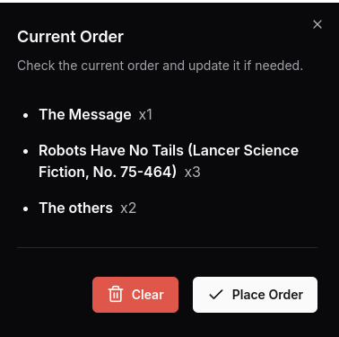

# Commerce Services - Technical Interview Solution

> [!NOTE]
> The original README with the assigment description can be found in
> the [ASSIGNMENT.md](ASSIGNMENT.md) file.

> [!IMPORTANT]
> This branch is built on top of the
> [assignment branch](https://github.com/iivvaannxx/magento-order-management/tree/assignment).
> It extends that solution with a frontend application that can be used to play with the
> API. Make sure to check out that branch for the original solution.

## Table of Contents

* [Commerce Services - Technical Interview Solution](#commerce-services---technical-interview-solution)
    * [Table of Contents](#table-of-contents)
    * [Introduction](#introduction)
    * [Features](#features)
    * [How to run](#how-to-run)
    * [How to use](#how-to-use)
    * [Implementation details](#implementation-details)

## Introduction

This branch contains an extension of
[my solution](https://github.com/iivvaannxx/magento-order-management/tree/assignment)
to the Technical Interview assignment. In my interview with Alejandro, he mentioned that
the role involves a mix of frontend, DevOps and backend responsibilities. To showcase my
ability to contribute across these diverse areas, I've created this branch with "extra"
features that are not part of the original requirements.

## Features

Aside from the original features, this branch adds the following:

- A simple frontend application that interacts with the backend API.
- A new endpoint to delete an order.
- A simple CI/CD pipeline that runs on GitHub Actions.

My initial idea was to create a CI/CD pipeline that would run on a self-hosted Jenkins
server and deploy the application to AWS, in order to align more closely with the
responsibilities of the role. However, I realized that this would have been going a bit
too far beyond what was originally asked for. Aside from that, publishing the application
on the internet would have required setting up a full production environment, and
potentially some authentication as well (due to the nature of the application).

Therefore, I decided to go with a simpler approach: a CI/CD pipeline that would run on
GitHub Actions and package the application as a Docker image.

## How to run

The application is packaged as a Docker image and can be run using the following command:

```bash
$ docker run -p 8080:8080 iivvaannx/bookstore:latest
``` 

Docker will automatically download the image from Docker Hub and start the application,
you can access
it in your browser at [http://localhost:8080](http://localhost:8080).

## How to use

The frontend application is intended to be used as a playground to experiment with the API
in a more interactive way. Upon starting the application, you will be presented with a
list of books and their stock. You can add new books to the current order by modifying the
quantity and clicking the "Add to Order" button.

If the book is already in the order you can set the quantity to 0 and click the "Remove"
button to remove it from the order. Or you can simply change the quantity and click the
"Update" button to update the desired units in the order.


If you click on the "Current Order" button at the top right you'll be able to see what
books are currently in the order. Whenever you want to place an order, open that dialog
and click the "Place Order" button. If you want to clear the order, click the "Clear"
button.

<div align="center">
  
</div>

After placing the order, you'll be able you can go to the "Orders" page to see the
list of orders and their details. You can also delete an order by clicking the delete
button at the right of every listed order.


The application is build so that it syncs across different browser tabs. This means that
if you place an order, add books to the current order, or delete an order from a browser
tab,
the changes will be reflected in other tabs as well.

This is done by using the `localStorage` API and Server-Sent
Events ([SSE](https://developer.mozilla.org/en-US/docs/Web/API/Server-sent_events)). I
implemented a very basic SSE Controller in the backend that sends updates whenever the
following happens:

- The stock of a book is updated (due to a new order)
- An order is created or deleted.

The frontend listens to these events and updates the UI accordingly.

## Implementation details

The frontend is build with [React](https://react.dev) and [Astro](https://astro.build/), a
framework that allows building static sites with a component-based approach. Because the
easiest way to serve a website using Spring Boot is to serve static files from the
`resources/static` directory, I decided to build the frontend as a static site.

In order to make the application usable, it was necessary to make changes to the
`BookStock` entity, which I renamed to `Book` and added extra fields to it. Then I used a
public book api to retrieve some data and change the `import.sql` file to populate the
database with this data.
